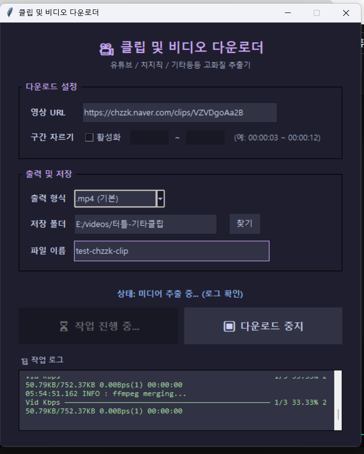

## 다운로드

[윈도우 다운로드](https://github.com/Area-01/Clip-Video_Downloader/raw/refs/heads/main/dist/cliper.zip)

다운로드 이후 압축을 풀고 `cliper.exe`와 같은 위치의 `bin` 폴더를 유지한 채 `cliper.exe`를 실행해 주세요.

## Credits & License
이 프로그램은 아래의 오픈소스 프로젝트들을 사용합니다.
- [yt-dlp](https://github.com/yt-dlp/yt-dlp): Unlicense
- [FFmpeg](https://ffmpeg.org/): LGPL/GPL
- [N_m3u8DL-RE](https://github.com/nilaoda/N_m3u8DL-RE): MIT License
